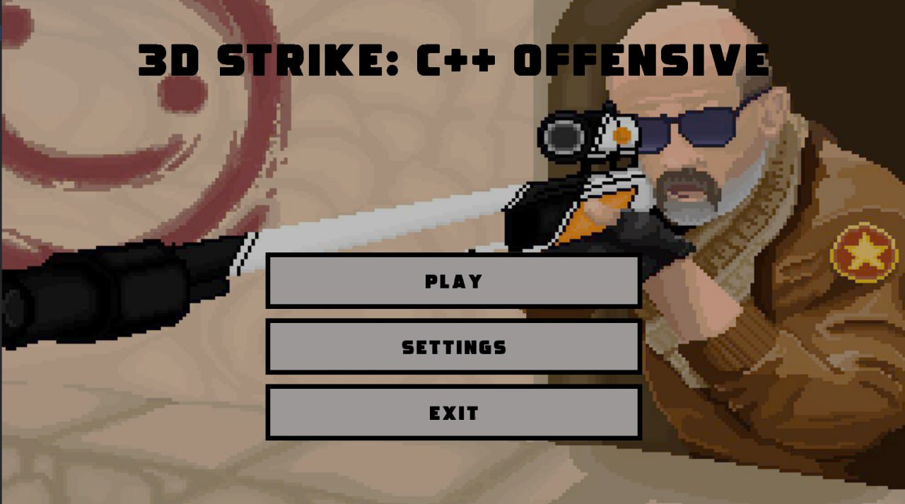
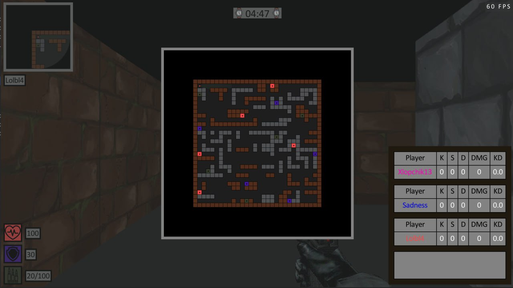
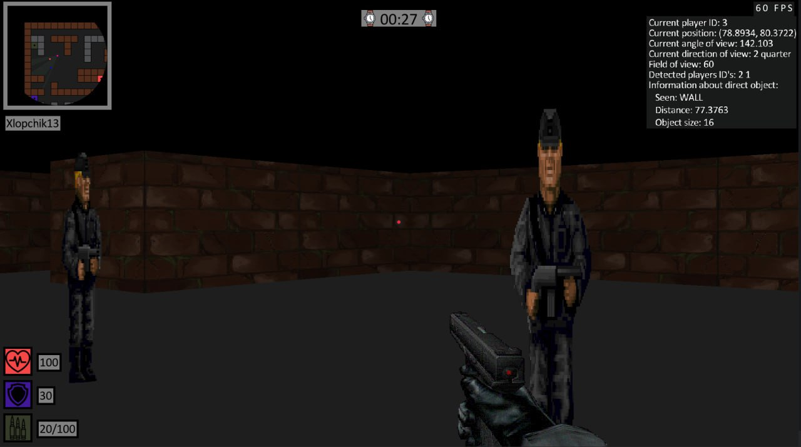
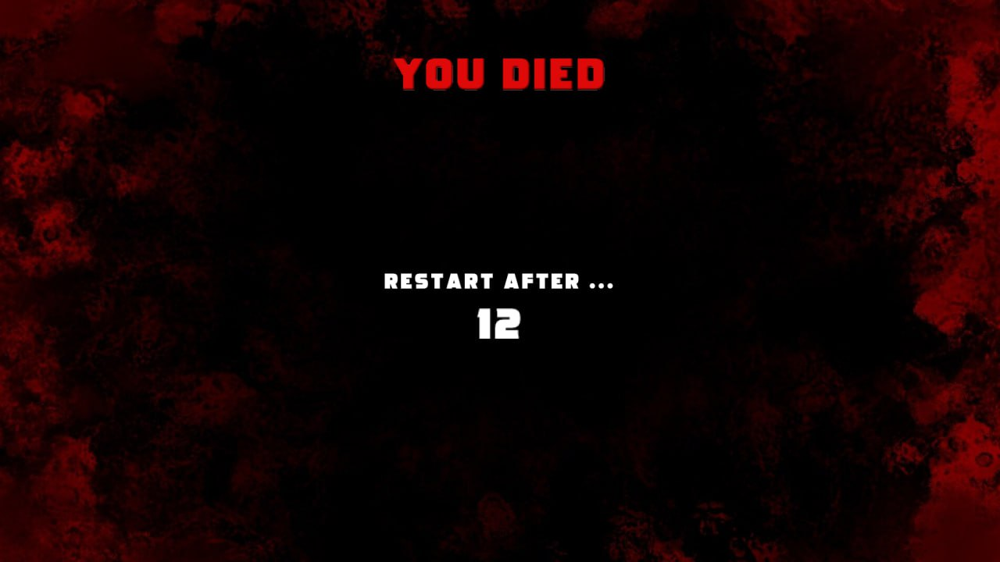
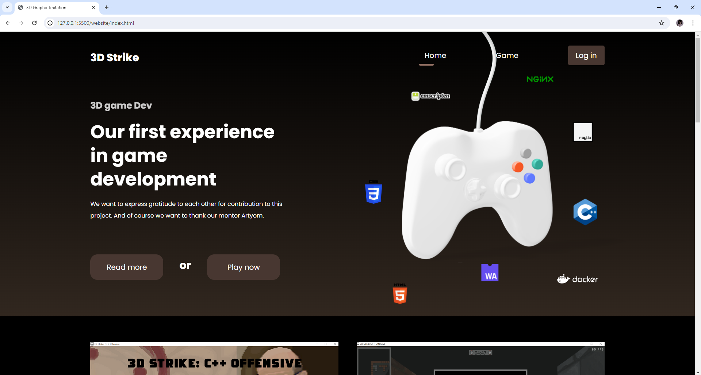
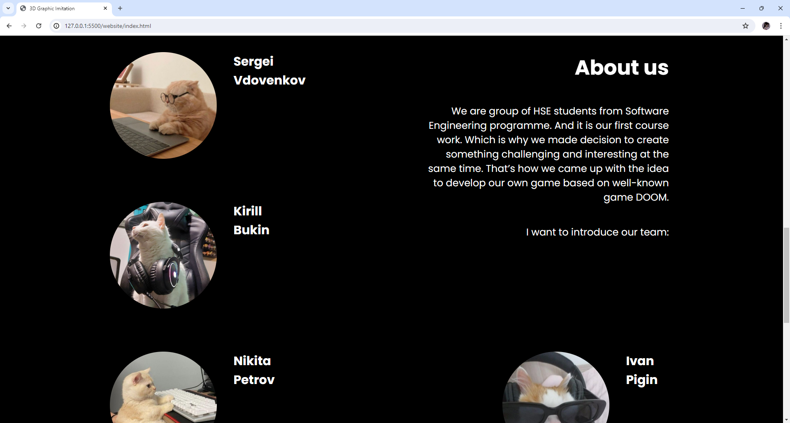

# Имитация 3D графики в 2D консоли на модели игры «DOOM»

## Запуск игры (Desktop version without multiplayer)

1. Перейдите в папку `Rendering Raylib`;
2. Создайте папку `build` командой `mkdir build` и перейдите в неё командой `cd build`;
3. Выполните команду `cmake ..` для получения Makefile, если по умолчанию стоит конфигурация MinGW Makefiles;

> [!NOTE]
> Если по умолчанию стоит другая конфигурация, то выполните `cmake .. -G "MinGW Makefiles"`.

> [!NOTE]
> В качестве компилятора C++ желательно использовать одну из последних версий MinGW. Его можно найти, например, скачав библиотеку [Raylib](https://www.raylib.com/). Компилятор будет находиться по пути `C:\raylib\w64devkit\bin\g++.exe`.

4. В папке `build` выполните команду `make`, чтобы выполнить сборку и получить исполняемый файл .exe;
5. Выйдите из папки `build` через `cd ..` и запустите файл `main.exe` с помощью команды `./main.exe`;

## Запуск тестов

Алгоритм запуска тестов:

1. Перейдите в папку `tests` командой `cd tests`;
2. Используя файл CMakeLists.txt для сборки проекта, выполните команду `cmake -S . -B build`;
3. После окончания создания папки `build` выполните следующую команду: `cmake --build build`;
4. Перейдите в папку `build` командой `cd build`;
5. Запустите тесты командой `ctest`;

Результаты тестирования будут отображены в консоли.

## Website

1. Развёртка происходит с помощью команды `docker-compose up`; 
2. После этого становится возможным открыть сайт через localhost на 80 порте (`localhost:80`);